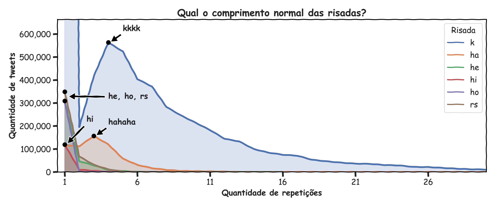

# Com quantos k's se faz um kkkk? 
## OU: um estudo sobre risadas na internet

### UM MISTÉRIO APETITOSO

Tem projetos que eu me lembro de onde vieram -- esse não é um deles. Um dia surgiu no meu Google Keep uma nota intitulada "*quantos k's as pessoas põem no kkkk quando elas vão ri?*" (sic), e desde então isso tem me assombrado. 1 'k' é uma letra, 2 é um jogador, 3 é um possível mal-entendido; será 4 então, a quantidade canônica de k's numa risada? Ou será que 4 é apenas o mínimo, um protótipo de risada, e 5 k's é o ideal? Há algo no 'kkkkk' que atrai, afinal de contas, algo que intriga de uma forma que a simetria do 'kkkk' é incapaz de reproduzir... Ou será que essa simetria só não atingiu um tamanho suficiente, e que 6 k's -- um suculento 'kkkkkk' -- é o \*chef's kiss\*? 

Não existe definição objetiva de quantos k's formam uma risada, é claro: as pessoas riem com quantos k's elas quiserem, e pelo contexto entendemos o que elas querem dizer (poucos k's é um arzinho pelo nariz, muitos k's é uma gargalhada gostosa, etc). Mas a pergunta persiste: *quantos k's as pessoas **normalmente** põem quando riem?* Existem dados, e eles certamente falam alguma coisa. O que será que eles dizem?

### Aside: Sobre os dados

De onde tiramos os dados? A escolha mais óbvia é... o Twitter. Este site amaldiçoado pelo capeta é o padrão de ouro no quesito "saber o que as pessoas falam na internet", especialmente no [meio acadêmico](https://www.theverge.com/2023/5/31/23739084/twitter-elon-musk-api-policy-chilling-academic-research). Seria só questão da gente buscar quantos tweets tem "kkk", quantos "kkkk", quantos "kkkkk" e assim por diante, nos dando uma noção de qual quantidade de k's é a mais utilizada.

Qual o problema disso tudo? O problema é que um bilionário veio e simplesmente zoou o bagulho todo: a API do Twitter foi pro [caralho](https://mashable.com/article/twitter-api-elon-musk-developer-issues-apps), e não tem nenhuma perspectiva de melhora. A API antiga tinha um "acesso acadêmico" que permitia o usuário consultar gratuitamente 10 milhões de tweets por mês; já a nova API, por outro lado, me obriga a pagar 100 dólares americanos apenas pra *consultar tweets em geral*. Incrível!

Nesse contexto, a solução gambiarrenta que eu inventei foi... usar o Google. Ao invés de perguntar ao Twitter quantos tweets tem "kkkk", eu pergunto ao Google quantos resultados ele encontra com "kkkk", mas passando adicionalmente a especificação "site:twitter.com" (que restringe os resultados aos que estão baixo domínio do Twitter). É meio sujo? Com certeza! Mas funciona? Acho que sim! Não tenho nenhuma opção melhor, então é isso ou nada. Se você tiver 100 dólares dando sopa por aí ou for sobrinho do Elon Musk (mais provável), minhas DMs estão abertas em @novozodiaco

### A QUANTIDADE CANÔNICA DE K'S

Vamos começar com o mais básico: qual a quantidade de k's mais comum? Pra responder isso, basicamente peguei a quantidade de resultados pra 'k', 'kk', 'kkk' e assim por diante, e usei também um filtro adicional de idioma ("lr:lang_pt") pra ignorar resultados de outras línguas. Com isso, obtemos o seguinte gráfico:

Algo estranho acontece!! De maneira absolutamente desproporcional, aparentemente 1 'k' é a risada mais comum: tem mais de 8 milhões de tweets em português com 'k', sendo que os outros estão todos abaixo de 1 milhão de tweets! Isso faz sentido? Não 
muito. Se a gente analisar alguns dos resultados que ele tá retornando, o óbvio se torna evidente: 99% das vezes, o 'k' não é uma risada, mas sim uma letra usada pra abreviar alguma coisa (normalmente, "coreia do sul").

https://twitter.com/KLeagueBrazil/status/1688426661161877504
https://twitter.com/KBRASlL/status/1691815063533781038
https://twitter.com/kfestbrasil/status/1366803226738253825

Se a gente ignorar o k=1, as coisas começam a ficar mais interessantes:

Agora sim!! A nossa teoria inicial encontra embasamento empírico: 

- 2 k's é altamente incomum
- 3 k's é mais comum do que eu pensava (é provável que nem todos os tweets em português com 'kkk' sejam risadas)
- 4 k's é a quantidade mais comum de k's
- 5 k's vem logo atrás do 4 (praticamente empatado).
- A partir de k = 5, a quantidade de k's só decai, de maneira até surpreendentemente suave e comportada

Com isso, acho que dá pra bater o martelo: com quantos k's se deve rir? *quatro*. A forma CANÔNICA de se rir é 'kkkk'. Se sua mãe te mandar um meme no whatsapp e você rir 'kkkk' e ela reclamar que você riu pouco, responda-a de forma clara: 'não mãe, essa é a quantidade *normal* de k's, e eu rio de forma *normal* porque eu sou *normal*. e você mãe? como você ri?'. Não que eu tenha passado por isso, claro

### OUTRAS RISADAS

Evidentemente não precisamos parar por aqui: existem outras risadas em português, e podemos fazer perguntas parecidas a respeito delas! Infelizmente risadas como "heuahuehaeua", "askopaspoaspo" e "makldmaskmdks" são meio merda de analisar porque elas não seguem o mesmo formato de "partículas repetidas" (como 'kkk'), mas tem várias risadas clássicas que seguem sim esse padrão, como 'hahaha', 'hehehe', 'hihihi', 'hohoho', e 'rsrsrs'. Se a gente fizer o mesmo processo pra essas outras risadas, obtemos a seguinte figura:

...que parece fazer sentido, mais ou menos! 'hahaha' é o mais comum de todos os ha's, enquanto 'he', 'ho', 'rs' e 'hi' são os mais comuns de suas respectivas famílias. Parece provável, no entanto, que esteja acontecendo aqui uma contaminação parecida com o que a gente viu no 'k': ou seja, estamos pegando um monte de tweets que não tem risadas. Isso faz sentido porque 'he', 'hi', e 'ho' são palavras em inglês que podem ser usadas em outros contextos, enquanto 'rs' é literalmente a abreviação de Rio Grande do Sul. Se a gente ignorar o 'n = 1' de novo e der um zoom na parte que nos interessa, temos:

Que parece fazer bem mais sentido, ao meu ver! 'rsrs', 'hehe' e 'hihi' são os mais comuns nas suas famílias correspondentes, enquanto 'hahaha' continua sendo mais comum que 'haha'. Em particular, acho interessante esquecer por um momento a quantidade de repetições e olhar pra quantidade de caracteres: apesar de 'hehe', 'hihi' e 'rsrs' terem 2 repetições, teoricamente eles têm 4 caracteres, a mesma quantidade de caracteres do 'kkkk'! Será que tem algo em 4 caracteres que atrai as pessoas? É bastante curioso, ao meu ver; basta olhar pros dados acima pra concluir que eu tenho muito dado de 4. E essa provavelmente é a pior piada desse texto

Além disso, na figura acima dá pra ver que praticamente não existe nenhuma risada com mais de 7 repetições, o que também bate com a nossa intuição (qual foi a última vez que você viu alguém rindo com 'hehehehehehehehehe' ou 'hihihihihihihihi'? se alguém rir assim pra você, recomendo que fuja). Os únicos dois que fogem à essa regra são o 'ha' e o 'k', que costumam ser bem mais longos: dá pra ver que tem haha's de até uns 12 ha's, enquanto o kkk vai até sabe deus onde.

O único que fica de fora da figura acima é o 'ho', que tá tão baixinho que nem dá pra ver. Se a gente der um zoom:

*Ah.* Ok, faz sentido.

Por último, se a gente ignorar o tamanho da risada e somar a quantidade de tweets, dá pra chegar num ranking:

Que é mais ou menos o que o gráfico anterior já dava a entender, mas agora podemos dizer oficialmente: o 'kkkk' é a risada canônica *do Brasil*!

### AROUND THE WORLD

Tá, então até agora já mostramos que: (1) 4 k's é o mais comum, (2) outras risadas são bem menos populares, (3) as risadas com 'kkk' são particularmente *longas*. A próxima pergunta que surge é: e como nos comparamos com os outros países?

Pra isso, eu usei de uma ferramenta pouco conhecida (chamada "*Google*") que me permitiu descobrir como que as pessoas riem na internet ao redor do mundo. O melhor artigo que eu encontrei foi [esse aqui](https://digg.com/2018/how-different-countries-laugh-online) do Digg, que dá uma lista das risadas mais comuns nos países com mais internautas. Eu escolhi as seguintes:

1. 'k' (português)
2. 'w' (japonês)
4. 'ja' (espanhol)
5. 'ha' (inglês)
3. '5' (tailandês)
7. 'wk' (indonésio)
8. 'xa' (russo)

A partir daí foi só repetir o mesmo processo de antes, e eis:

Fascinante!! O 'kkkk', que tava lá em cima nos outros gráficos, agora foi lá pra baixo -- aparentemente a gente não ri tanto quanto os falantes dos outros idiomas. O título de "risada mais popular" agora vai pro 'www' do japonês, que muito provavelmente também tem uma certa contaminação (afinal de contas, links muitas vezes contém 'www'). Outros pontos curiosos são que no inglês o 'haha' é mais comum que o 'hahaha' (a gente viu que no português é o contrário), e que as risadas em russo praticamente nem aparecem no gráfico acima (certamente porque o Twitter [não é muito popular na Rússia](https://www.statista.com/statistics/867549/top-active-social-media-platforms-in-russia/), tendo sido inclusive bloqueado pelo governo russo em [pelo menos uma ocasião](https://www.theguardian.com/world/2022/mar/04/russia-completely-blocks-access-to-facebook-and-twitter)).

Se olharmos pro número absoluto de risadas, vemos que o 'ja' do espanhol leva o topo do ranking:

O que é natural, considerando que o espanhol é o [segundo idioma do mundo com mais falantes nativos](https://en.wikipedia.org/wiki/List_of_languages_by_number_of_native_speakers). Se olharmos uma análise per capita (usando a [quantidade de usuários no Twitter por cada idioma](https://worldpopulationreview.com/country-rankings/twitter-users-by-country)), a coisa fica um pouco diferente:

Nesse caso, quem ganha é o tailandês, com aproximadamente 0.3 risadas por usuário. Parece pouco né? Provavelmente porque uma quantidade enorme de usuários [não postam](https://www.pewresearch.org/internet/2019/04/24/sizing-up-twitter-users/) [nada](https://www.businessinsider.com/elon-musk-delete-inactive-twitter-accounts-free-up-handles-2022-12), o que acaba fazendo esses números diminuírem. Ainda assim, parabéns aos tailandeses eu acho!!

Se a gente quiser uma métrica que o Brasil se destaca, é só olhar pro *tamanho médio* de cada risada:

Aí sim ganhamos: apesar do 'kkkk' ser a forma mais comum de rir em português, nossos 'kkk's têm em média um respeitável 9,07 k's -- uma quantidade de caracteres maior do que todos os outros idiomas aqui analisados!!! Logo em seguida vem os hispanohablantes com 8,45 caracteres (i.e. 4,225 ja's), os tailandeses com 7,53 5's, e os anglófonos com 5,79 caracteres (i.e. 2,895 ha's); já os japoneses vem por último, com um minguado 3,87 w's. Diz o ditado que tamanho não é documento, mas se fosse, teríamos o maior documento de todos! (tá ESSA é a pior piada do texto inteiro)

### CONCLUSÂO

Ao longo deste texto aprendemos muitas coisas, as mais chocantes sendo:

1. Em português, o mais comum é rir com 'k';
2. Dentro das risadas com 'k', o mais comum é usar 4 k's ('kkkk'); 
3. Rimos menos no português quando comparado com outros idiomas; 
4. A nossa risada com 'k' é a mais longa em média, dentre os 7 idiomas analisados;
5. Em média, rimos com 9,07 k's.

E pra fechar, concluo com um truque de mágica: eu já te mostrei a risada mais comum ('kkkk'), agora vou te mostrar a risada *média*, com 9,07 k's. "*Mas peraí! 9 k's são 'kkkkkkkkk', beleza, mas e o 0,07? Você não consegue representar 0,07 k's!*" Pois pasme:

[Revele o segredo...]

kkkkkkkkk'

Perto o suficiente!!!

---

O ideal aqui seria fazer um cálculo *per capita*, ou seja, dividir o número de resultados pela quantidade de usuários falantes daquele idioma no Twitter. O problema é que eu não consegui encontrar nenhuma fonte confiável com essa informação: [esse artigo do PARC](https://www.parc.com/blog/languages-and-social-network-behaviors-top-10-languages-on-twitter/) parece muito bem-feito mas é de 2011, já [esse relatório](https://cvc.cervantes.es/Lengua/anuario/anuario_13/i_cervantes/p06.htm) do Instituto Cervantes é de 2022, mas não divulga a metodologia. Se os dois relatórios fossem parecidos tudo bem, mas eles não tem nada a ver um com o outro -- o da PARC diz que o japonês é o segundo idioma mais falado no Twitter, enquanto no Instituto Cervantes, esse posto é preenchido pelo espanhol (o que pode ou não ser um viés deles). 

Eu sempre fui fascinado por risadas de internet. Quando eu era pequeno (e por pequeno, quero dizer uns 8, 9 anos), eu ria na internet com "lol. Se fosse muito engraçado, "looool", e se fosse *muito* muito engraçado, então "LOOOOOOL!". Era patético. Hoje em dia eu não riria assim nem se você me pagasse; sou mais velho, superior: Houve uma época na minha vida em que eu ria "AHEUAHEUAEHAUEAE".